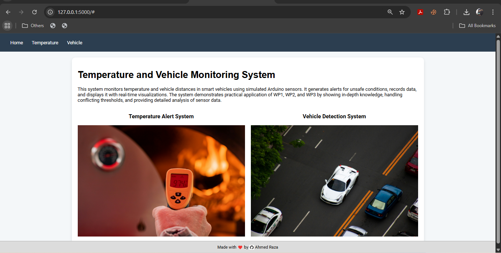
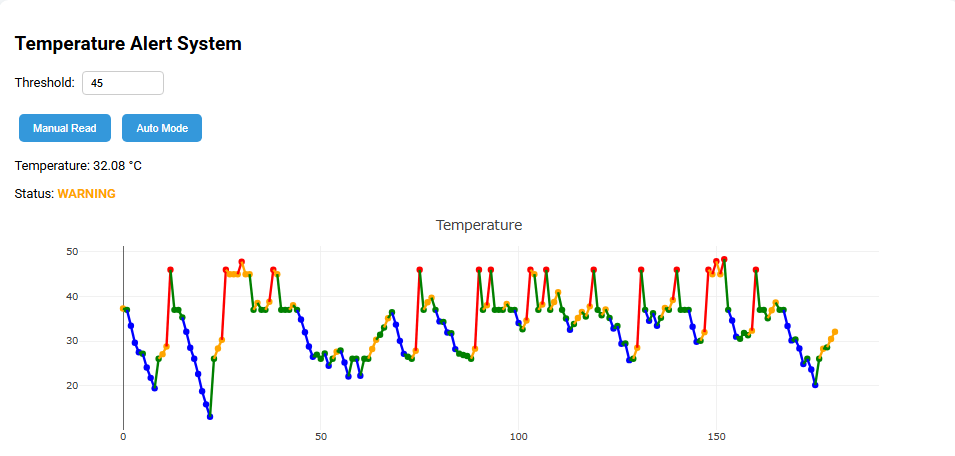
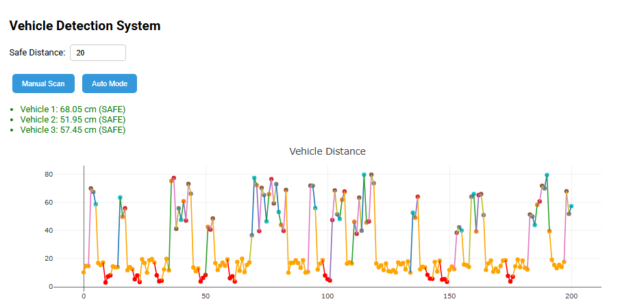

# Thermo-Drive: Temperature and Vehicle Monitoring System

**Author:** Ahmed Raza  
**GitHub:** [Ahmed-Raza-90](https://github.com/Ahmed-Raza-90)

---

## Project Overview
Thermo-Drive is a smart monitoring system for vehicles that tracks temperature levels and vehicle distances using simulated Arduino sensors. The system generates alerts for unsafe conditions, records data in real-time, and visualizes it using interactive graphs. This project demonstrates complex problem solving by applying WP1 (Depth of Knowledge), WP2 (Conflicting Requirements), and WP3 (Depth of Analysis).

- **Temperature Alert System:** Monitors temperature, compares with thresholds, and categorizes the reading as TOO COLD, NORMAL, WARNING, or ALERT.
- **Vehicle Detection System:** Measures distance of nearby vehicles, determines safe or unsafe proximity, and categorizes each vehicle as SAFE, WARNING, or ALERT.

---

## User Interface Preview

### Home Screen


### Temperature Monitoring Screen


### Vehicle Detection Screen


---

## Features
- Real-time temperature monitoring with alert thresholds
- Real-time vehicle detection with configurable safe distance
- Automatic and manual reading/scanning modes
- Graphical visualization of temperature and vehicle distance over time
- Logs all sensor data for further analysis
- Interactive web interface using Flask and Plotly

---

## Installation

1. **Clone the repository:**
```bash
git clone https://github.com/Ahmed-Raza-90/thermo-drive.git
cd thermo-drive
````

2. **Create a virtual environment (optional but recommended):**

```bash
python -m venv venv
source venv/bin/activate   # Linux/Mac
venv\Scripts\activate      # Windows
```

3. **Install dependencies:**

```bash
pip install flask
```

---

## Usage

1. **Run the Flask app:**

```bash
python app.py
```

2. **Open the web interface:**
   Go to `http://127.0.0.1:5000/` in your browser.

3. **Temperature Monitoring:**

* Set a threshold value and click "Manual Read" or enable "Auto Mode".
* Status will update in real-time.
* Graph shows temperature trends over time.

4. **Vehicle Detection:**

* Set safe distance and click "Manual Scan" or enable "Auto Mode".
* Vehicle statuses update in real-time.
* Graph shows vehicle distances over time.

---

## File Structure

```
thermo-drive/
├── app.py                         # Flask backend application
├── system_log.csv                 # CSV file for storing sensor logs
├── README.md                      # Project documentation
├── Thermo-Drive CCP Report.pdf    # Complete project report (PDF)
├── templates/
│   └── index.html                 # Main HTML UI template
└── static/
    ├── script.js                  # Frontend JavaScript logic
    ├── styles.css                 # CSS styling for UI
    ├── images/                    # Images used inside the web application
    │   ├── temperature.png
    │   └── vehicle.png
    └── ui/                        # UI screenshots shown in README
        ├── home-ui.png
        ├── temperature-ui.png
        └── vehicle-ui.png
```

---

## Technologies Used

* **Backend:** Python, Flask
* **Frontend:** HTML, CSS, JavaScript
* **Graphs:** Plotly
* **Data Storage:** CSV file (system_log.csv)

---

## How it Works

1. **Temperature Monitoring**

   * Generates a random temperature value to simulate Arduino readings.
   * Compares it with threshold and assigns a status.
   * Logs the reading with timestamp.

2. **Vehicle Detection**

   * Simulates distance readings for 1-4 vehicles.
   * Compares each distance with the safe distance threshold.
   * Logs each reading with timestamp.

3. **Graphs**

   * Display readings over time.
   * Colors indicate status (green = normal, orange = warning, red = alert, blue = too cold).

---

## Notes

* Auto mode periodically updates temperature and vehicle readings.
* All logs are saved in `system_log.csv` for review or analysis.
* Designed as a demonstration system; real Arduino integration requires hardware.

---

## Full Project Report

You can download the detailed project report here:  
[Thermo-Drive CCP Report](./Thermo-Drive%20CCP%20Report.pdf)

---

